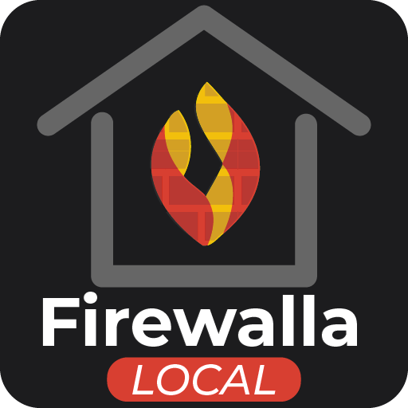

[](https://github.com/custom-components/hacs)
[](https://github.com/ccpk1/firewalla-local-ha/blob/main/LICENSE)
[](https://github.com/ccpk1/firewalla-local-ha/releases)
[](https://github.com/ccpk1/firewalla-local-ha/stargazers)



# Firewalla Local

Firewalla Local is a standalone Home Assistant custom integration for Firewalla.

It pairs with your Firewalla box using the Firewalla app QR payload, connects to
the local box over the verified local protocol, and exposes a deliberately small
set of Home Assistant surfaces built around proven runtime behavior.

## What it supports today

- UI config flow with local runtime validation before entry creation
- Reauthentication flow with fresh QR input
- Reconfigure flow for host updates
- Options flow for selected rule-backed switches
- Rule-backed switch platform for the currently supported rule subset
- Runtime inventory, pause, and resume services
- Diagnostics with redaction coverage
- English translations and typed runtime data from day one

## Current boundaries

- Only a supported subset of Firewalla rules can be exposed as Home Assistant switches
- Broader rule-family mutation support beyond the current switch-backed slice is not implemented yet
- Discovery is not implemented yet
- This integration does not attempt speculative fallback behavior outside the proven local protocol path

## ❤️ Support the Project

If Firewalla Local provides value to you, here are a few ways you can fuel its development and prevent open-source burnout!

⭐ **Star this repository!**
If you like this integration, the best (and free!) thing you can do is click the Star button at the top of this page. It helps other users discover the project and builds trust as we grow.

[](https://github.com/sponsors/ccpk1)
[](https://buymeacoffee.com/ccpk1)


## Quick installation

### One-click HACS install

[](https://my.home-assistant.io/redirect/hacs_repository/?owner=ccpk1&repository=firewalla-local-ha&category=integration)

### Manual HACS setup

1. Ensure HACS is installed.
2. In Home Assistant, open **HACS -> Integrations -> Custom repositories**.
3. Add `https://github.com/ccpk1/firewalla-local-ha` as an **Integration** repository.
4. Search for **Firewalla Local**, install it, and restart Home Assistant.
5. Open **Settings -> Devices & Services -> Add Integration**.
6. Choose **Firewalla Local** and complete the QR-based pairing flow.

## User guide

The minimal user-facing operating guide lives in `docs/USER_GUIDE.md`.

It covers:

- installation and removal
- pairing expectations
- refresh behavior
- the rule-backed switch surface
- runtime inventory, pause, and resume services

## Security and support posture

- Vulnerability reporting guidance lives in `SECURITY.md`
- The high-level security approach, trade-offs, and awareness notes live in `docs/ARCHITECTURE.md`
- This repository should not be treated as an official Firewalla integration or as a Firewalla support channel

## Disclaimer

This is an independent community project. It is not affiliated with, endorsed by,
or supported by Firewalla.

Use it at your own risk.

## Development and architecture docs

The durable project rules live in:

- `docs/ARCHITECTURE.md`
- `docs/DEVELOPMENT_STANDARDS.md`
- `docs/QUALITY_REFERENCE.md`

Repository layout:

```text
custom_components/firewalla_local/
tests/components/firewalla_local/
docs/
firewalla-dev.code-workspace
pyproject.toml
```

## Community and contribution

- Issues and feature requests: https://github.com/ccpk1/firewalla-local-ha/issues
- Discussions: https://github.com/ccpk1/firewalla-local-ha/discussions
- Pull requests: https://github.com/ccpk1/firewalla-local-ha/pulls

## License

This project is licensed under the GPL-3.0 license. See `LICENSE`.